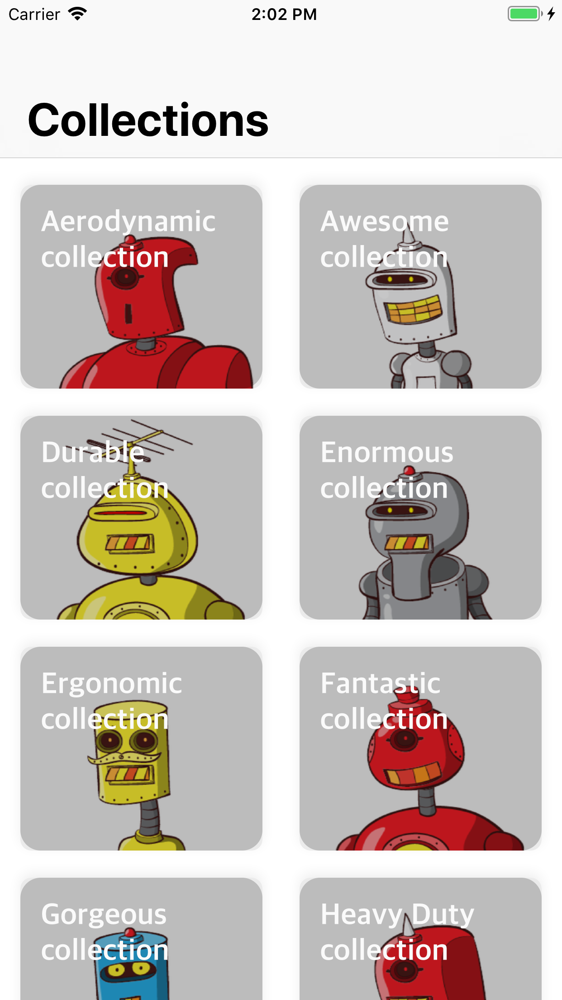
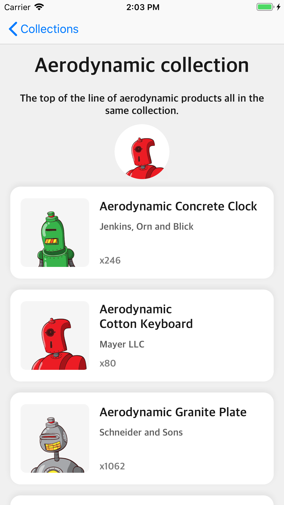

# Shopify Mobile Developer Intern Challenge 2019

This project is built for Shopify's summer/winter mobile developer internship position. 

## Screenshots

 


## Getting Started

```bash
git clone https://github.com/ShennyO/Shopify-Mobile-Developer-Intern-Challenge---Summer-2019.git
```
After cloning, go into the root directory of the project and install the necessary pods 

```bash
pod install
```
    

## Pods and API

* Shopify REST API 
* SnapKit - A Swift Autolayout DSL for iOS & OS X <http://snapkit.io>
* Kingfisher - A lightweight, pure-Swift library for downloading and caching images from the web <https://github.com/onevcat/Kingfisher>


## Author

* Sunny Ouyang


